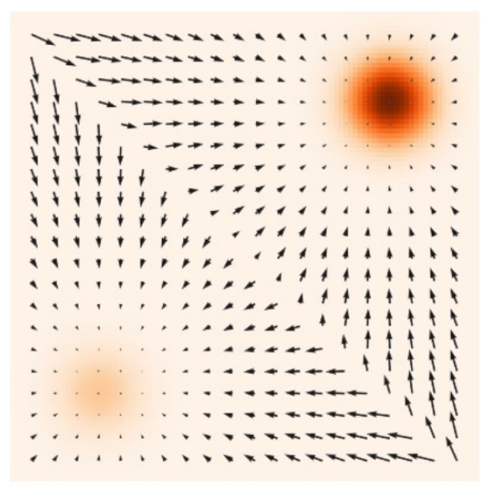
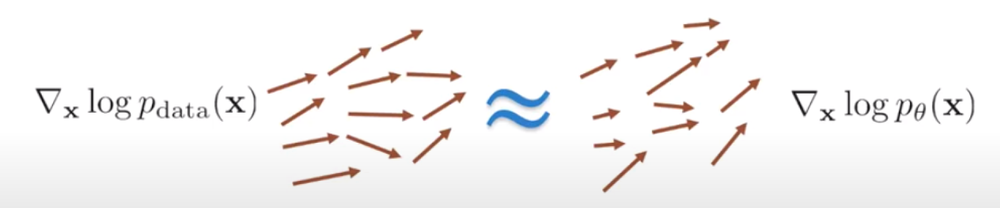
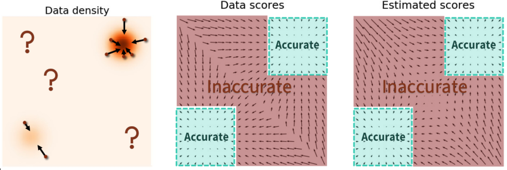
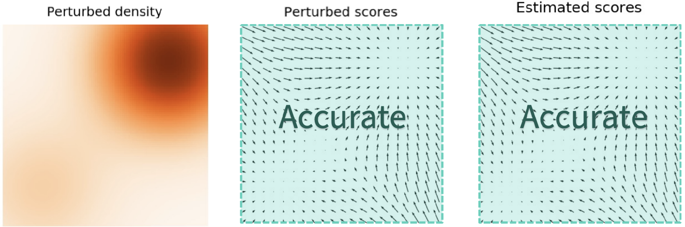

# Score-Based Generative Models

Score-based generative models are a major milestone in modern generative modeling and form the conceptual bridge between **energy-based models** and **diffusion models**.

Instead of learning a full probability density directly, they learn the **gradient of the log-density**, called the **score function**, and use it to transform noise into realistic samples.

---

# 1. Motivation

In likelihood-based generative models, we try to learn:

$$
p_\theta(x)
$$

the full probability density of the data.

This is difficult because:

- high-dimensional densities are extremely complex
- normalization constants may be intractable
- exact likelihood may be hard or impossible to compute

Score-based models take a different view:

Instead of learning:

$$
p(x)
$$

learn:

$$
\nabla_x \log p(x)
$$

the direction in data space that increases probability most rapidly.

This means:

- we do not need exact probability values
- we only need to know how to move samples toward more likely regions

---

# 2. Score Function

The score function is defined as:

$$
\nabla_x \log p(x)
$$

where:

- $p(x)$ = data probability density
- gradient is taken with respect to the data point $x$

This is **not** a gradient with respect to model parameters.

Compare:

Training gradient:

$$
\nabla_\theta L(\theta)
$$

asks:

> How should model parameters change?

Score gradient:

$$
\nabla_x \log p(x)
$$

asks:

> How should the sample itself move to become more likely?

  

---

## Example: Standard Gaussian

Suppose:

$$
p(x)=\mathcal N(0,1)
$$

Then:

$$
p(x)=\frac{1}{\sqrt{2\pi}}e^{-x^2/2}
$$

Taking log:

$$
\log p(x)=C-\frac{x^2}{2}
$$

Derivative:

$$
\frac{d}{dx}\log p(x)=-x
$$

So:

$$
s(x)=-x
$$

Interpretation:

- if $x=3$, move left
- if $x=-2$, move right
- score points toward higher density

---

# 3. Score Estimation Problem

We want to learn:

$$
s_\theta(x)\approx \nabla_x \log p_{\text{data}}(x)
$$

But we do not know:

$$
p_{\text{data}}(x)
$$

so we do not know the target score.

Naively, we would want:

$$
\mathcal L=
\mathbb E_{p(x)}
\left[
\left\|
s_\theta(x)-\nabla_x\log p(x)
\right\|^2
\right]
$$

But this is impossible because the true score is unknown.

---

# 4. Fisher Divergence and Score Matching

This objective defines **Fisher divergence**:

$$
D_F(p\|q)=
\mathbb E_{p(x)}
\left[
\left\|
\nabla_x\log p(x)-\nabla_x\log q(x)
\right\|^2
\right]
$$

This compares score fields instead of densities.

Hyvärinen showed this can be rewritten into a computable form:

$$
J(\theta)=
\mathbb E_{p(x)}
\left[
\frac{1}{2}\|s_\theta(x)\|^2
+
\nabla_x \cdot s_\theta(x)
\right]
$$

where divergence is:

$$
\nabla_x \cdot s_\theta(x) =
\sum_i \frac{\partial s_i(x)}{\partial x_i}
$$

This avoids needing the unknown true score directly.

  

---

# 5. The Manifold Problem

Real data distributions are not smooth everywhere.

Example:

MNIST images live in:

$$
\mathbb R^{784}
$$

but valid digits occupy only a tiny structured subset.

Similarly, face images in:

$$
\mathbb R^{12288}
$$

occupy a tiny manifold.

This causes problems:

outside the data manifold:

$$
p(x)\approx 0
$$

so:

$$
\log p(x)\to -\infty
$$

and:

$$
\nabla_x\log p(x)
$$

becomes unstable or undefined.

This is catastrophic because sampling starts from random noise far away from the data manifold.

  

---

# 6. Gaussian Smoothing

Solution:

add Gaussian noise to data:

$$
\tilde x=x+\sigma\epsilon
$$

where:

$$
\epsilon\sim\mathcal N(0,I)
$$

This creates a smoothed distribution:

$$
p_\sigma(\tilde x) =
\int p(x)\mathcal N(\tilde x;x,\sigma^2I)\,dx
$$

Now probability mass spreads into nearby space.

Instead of learning:

$$
\nabla_x\log p(x)
$$

we learn:

$$
\nabla_{\tilde x}\log p_\sigma(\tilde x)
$$

which is smooth and well-defined.

  

---

# 7. Denoising Score Matching

We still do not know:

$$
\nabla_{\tilde x}\log p_\sigma(\tilde x)
$$

But for Gaussian corruption:

$$
q_\sigma(\tilde x|x)=\mathcal N(\tilde x;x,\sigma^2I)
$$

its score is known:

$$
\nabla_{\tilde x}\log q_\sigma(\tilde x|x) =
-\frac{\tilde x-x}{\sigma^2}
$$

Since:

$$
\tilde x-x=\sigma\epsilon
$$

this becomes:

$$
-\frac{\epsilon}{\sigma}
$$

Training objective:

$$
\mathcal L=
\mathbb E
\left[
\left\|
s_\theta(x+\sigma\epsilon,\sigma)
+
\frac{\epsilon}{\sigma}
\right\|^2
\right]
$$

So the model learns to point noisy samples back toward cleaner regions.

---

# 8. Langevin Dynamics Sampling

Once we have a score model:

$$
s_\theta(x)\approx \nabla_x\log p(x)
$$

we can sample.

Naive gradient ascent:

$$
x_{t+1}=x_t+\eta s_\theta(x_t)
$$

fails because it collapses to local modes.

Add noise:

$$
x_{t+1} =
x_t
+
\eta s_\theta(x_t)
+
\sqrt{2\eta}z_t
$$

where:

$$
z_t\sim\mathcal N(0,I)
$$

This is **Langevin dynamics**.

Interpretation:

- score term → moves toward high density
- noise term → encourages exploration

---

# 9. Annealed Langevin Dynamics

In practice, we learn scores for noisy distributions:

$$
s_\theta(x,\sigma)
\approx
\nabla_x\log p_\sigma(x)
$$

not clean data directly.

So sampling proceeds across multiple noise levels:

$$
\sigma_1>\sigma_2>\cdots>\sigma_K
$$

Algorithm:

Initialize:

$$
x\sim\mathcal N(0,I)
$$

For each noise scale:

$$
x
\leftarrow
x
+
\eta_k s_\theta(x,\sigma_k)
+
\sqrt{2\eta_k}z
$$

with:

$$
z\sim\mathcal N(0,I)
$$

Then reduce:

$$
\sigma_k
$$

Interpretation:

- large sigma → global structure
- medium sigma → rough refinement
- small sigma → fine details

This is **annealed Langevin dynamics**.

---

# 10. Sliced Score Matching

Classic score matching requires divergence:

$$
\nabla_x\cdot s_\theta(x)
$$

which is expensive in high dimensions.

Instead, sliced score matching uses random projections.

Choose:

$$
v\sim\mathcal N(0,I)
$$

and compare projected scores:

$$
v^T s_\theta(x)
$$

This avoids explicit full Jacobian computation.

Using Hutchinson’s identity:

$$
\mathrm{Tr}(A)=\mathbb E_v[v^TAv]
$$

we can estimate divergence efficiently.

---

# 11. Final Big Picture

Score-based generative modeling pipeline:

### Step 1

Want to model:

$$
p(x)
$$

---

### Step 2

Learn score instead:

$$
\nabla_x\log p(x)
$$

---

### Step 3

Real data lies on manifolds → score unstable

---

### Step 4

Smooth data with Gaussian noise:

$$
p_\sigma(x)
$$

---

### Step 5

Train via denoising score matching:

$$
s_\theta(x,\sigma)
\approx
-\frac{\epsilon}{\sigma}
$$

---

### Step 6

Generate samples with annealed Langevin dynamics

noise → structure → detail

---

# Historical Connection

Conceptual evolution:

**Energy-Based Models**
→ learn scalar energy:

$$
E(x)
$$

**Score Models**
→ learn gradient directly:

$$
\nabla_x\log p(x)
$$

**Diffusion Models**
→ structured noise corruption + learned reverse denoising

Modern diffusion models are direct descendants of score-based generative modeling.
